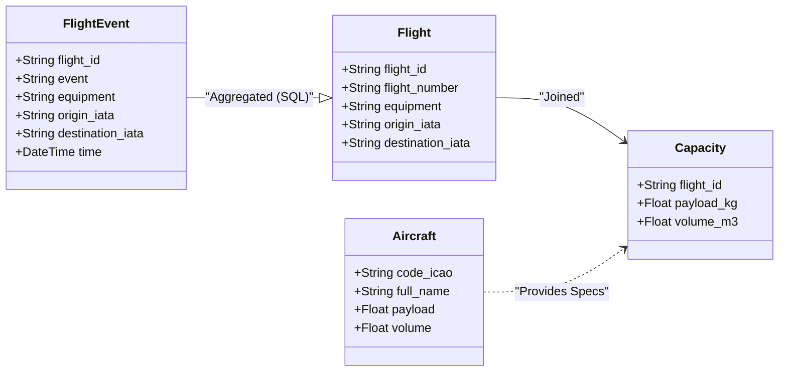
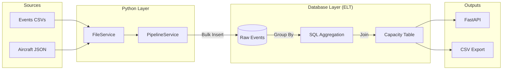
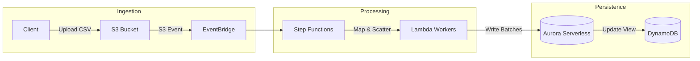
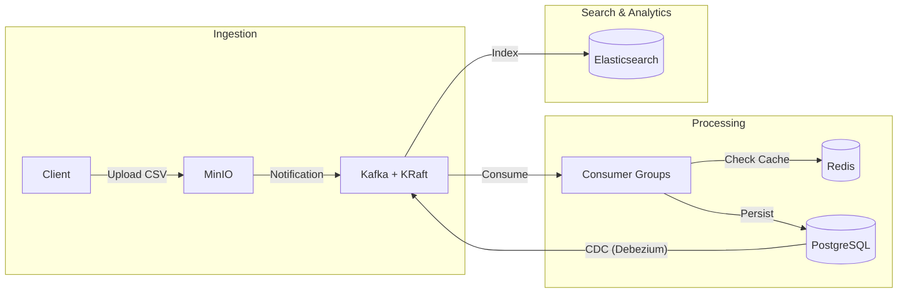

# Rotate Cargo Capacity — Design & Architecture

> **Design Flow:**
> 0.Understanding → 1.Requirements → 2.Core Entity → 3.API/Interface → 4.Data Flow → 5.High-level Design → 6.Deep Dive / Low-level Design
>
> - High-level Design → Requirements **[Primary Goal: Satisfy Functional Requirements]**
> - Deep Dive / Low-level Design → Requirements **[Primary Goal: Satisfy Non-Functional Requirements]**

---

## 0. Understanding

### Problem Statement

**Rotate** helps airlines make data-driven commercial decisions. A core metric is **available cargo capacity** — how much weight (kg) and volume (m³) can be shipped between airports given current flights and aircraft.

### Input Data

| Dataset | Format | Size | Description |
|---|---|---|---|
| `flight_events/*.csv` | Semicolon-delimited CSV, 7 files (Oct 3–9, 2022) | **700K rows, 76 MB** | Real-time ADS-B events from Flightradar24 |
| `airplane_details.json` | JSONL (one JSON object per line) | **100 rows, 16 KB** | Aircraft specs: payload (kg) + volume (m³) |

### Key Data Characteristics

- **Delimiter is `;`** — not comma, despite the `.csv` extension
- **Multiple events per flight** — a single `flight_id` emits 2–6 events (gate_departure, takeoff, cruising, descent, landed, gate_arrival)
- **Missing fields** — ~19% of rows have empty `flight`, `origin_iata`, or `origin_icao`
- **Unmatched equipment** — only 100 aircraft types provided; 612 unique equipment codes in events have no match
- **Join key** — `flight_events.equipment` → `airplane_details.code_icao`

---

## 1. Requirements

### Functional Requirements (FR)

| ID | Requirement | Maps to |
|----|-------------|---------|
| FR-1 | Load and model flight event CSVs + aircraft JSONL so data is queryable and reusable | Challenge Q1 |
| FR-2 | Deduplicate events → one row per `flight_id`, then join with aircraft details to produce a capacity table (payload_kg, volume_m3 per flight) | Challenge Q2 |
| FR-3 | Expose an API endpoint accepting two airports → returns total capacity per day | Challenge Q3 |
| FR-4 | Handle missing/dirty data gracefully (empty fields, unmatched equipment codes) | Challenge Q2 hint |

### Non-Functional Requirements (NFR)

| ID | Requirement | Decision |
|----|-------------|----------|
| NFR-1 | Process 700K rows in reasonable time (<30s pipeline, <100ms queries) | Streaming loaders → ELT approach (SQLite aggregation) |
| NFR-2 | Simple, readable, no over-engineering | Pure Python + Pydantic + stdlib `csv` + `sqlite3` |
| NFR-3 | Testable at every layer independently | Dependency Injection via Container |
| NFR-4 | Minimal external dependencies | Only `fastapi`, `uvicorn`, `pydantic` |

---

## 2. Core Entities

Pydantic domain models represent the data at each stage of the pipeline.



### Why Pydantic?

- **Validation on parse** — CSV rows are raw strings; `field_validator` coerces types and handles defaults.
- **Schema consistency** — same model validates input AND serializes to API responses.

---

## 3. API / Interface

### CLI Entry Point

```bash
# Initialize DB, run pipeline (extract -> load -> transform), and export results
python -m src.cli ingest
```

### REST API (FastAPI)

```bash
uvicorn src.handlers.http.app:create_app --factory --port 8000
```

| Method | Endpoint | Description |
|--------|----------|-------------|
| `GET` | `/health` | Health check |
| `GET` | `/api/v1/capacity?origin=X...&limit=100&offset=0` | Per-flight capacity list. Filters: origin, destination (IATA/ICAO), date. Pagination included. |
| `GET` | `/api/v1/capacity/summary?origin=X&destination=Y` | Daily aggregated summary for a route (IATA or ICAO). |

---

## 4. Data Flow

The pipeline follows an **ELT (Extract, Load, Transform)** approach to handle data efficiently without excessive memory usage.

1.  **Extract**: `FileService` streams raw CSV/JSON files.
2.  **Load**: `PipelineService` bulk inserts raw rows into SQLite staging tables.
3.  **Transform**: SQL queries aggregate events into flights and calculate capacity.
4.  **Serve**: Data is exposed via REST API or exported to CSV.



---

## 5. High-level Design (Satisfies Functional Requirements)

### Project Structure

```
flight-capacity-pipeline/
├── src/
│   ├── core/                          # Configuration & wiring (DI Container)
│   ├── domains/                       # Pydantic domain models
│   ├── services/                      # Business logic
│   │   ├── file_service.py            #   Raw file I/O (CSV/JSON parsers)
│   │   └── pipeline_service.py        #   Orchestrator: Extract -> Load -> Transform
│   ├── repositories/                  # Data persistence
│   │   ├── queries.py                 #   SQL scripts (Transformation logic)
│   │   └── sqlite_repository.py       #   DB operations
│   ├── handlers/                      # Interface layer
│   │   ├── cli/                       #   Command Line Interface
│   │   └── http/                      #   FastAPI endpoints
```

### Layer Responsibilities

| Layer | Responsibility | Key Components |
|-------|----------------|----------------|
| **Core** | Wiring, config, logging setup | `ContainerRegistry`, `Settings` |
| **Services** | Orchestration, File I/O, no DB logic | `PipelineService`, `FileService` |
| **Repositories** | DB interaction, SQL execution | `SQLiteRepository`, `queries.py` |
| **Domains** | Data shape definition & validation | `Flight`, `Capacity`, `Aircraft` |
| **Handlers** | Entry points (Web/CLI) | `cli.py`, `http/routes.py` |

---

## 6. Deep Dive / Low-level Design (Satisfies Non-Functional Requirements)

### 6.1 ELT Pattern (NFR-1: Performance)

**Problem:** Aggregating 700K rows in Python requires loading all objects into memory or complex state management, which is slow and memory-intensive.

**Solution:** Delegate transformation to the database engine.
1.  **Extract:** `FileService` streams lines from CSVs using generators (memory efficient).
2.  **Load:** `SQLiteRepository` uses `executemany` for bulk insertion into a staging table (`raw_flight_events`).
    *   **Idempotency:** A `processed_files` table tracks imported files. Files are skipped if already processed.
3.  **Transform:** SQL queries aggregate events into flights using window functions (`ROW_NUMBER()`) to pick the latest event deterministically.

**Trade-off:**
*   *Pros:* Very fast (SQLite is C-optimized), drastically simpler Python code.
*   *Cons:* Logic moves to SQL (harder to unit test than pure Python functions).

### 6.2 Data deduplication strategy (FR-2)

**SQL Logic in `queries.py`:**
```sql
INSERT INTO flights (...)
SELECT ...
FROM (
    SELECT 
        *,
        ROW_NUMBER() OVER (PARTITION BY flight_id ORDER BY date DESC, time DESC) as rn
    FROM events
)
WHERE rn = 1;
```
This handles "multiple events per flight" deterministically by selecting the *latest* event for each flight ID.

### 6.3 Edge Cases & Error Handling

| Case | Handling Strategy |
|------|-------------------|
| **Malformed CSV rows** | `FileService` catches `ValidationError` per row, logs warning, and continues (skips bad rows). |
| **Missing Aircraft** | `LEFT JOIN` in SQL between `flights` and `aircraft`. Flights with unknown equipment are INCLUDED with `unknown_aircraft` status and NULL capacity. |
| **Empty File / No Data** | Pipeline logs "0 events processed" but doesn't crash. |
| **Re-run Pipeline** | `PipelineService` checks for existing processed files in `processed_files` table to avoid duplicate processing (idempotency). |

---

## 7. Cloud Scale Proposal (AWS & Kafka)

We present two distinct architectural approaches for scaling the pipeline: **Option A (AWS Serverless)** for cost-effective batch processing of large datasets, and **Option B (Kafka Streaming)** for low-latency real-time ingestion.

### Option A: AWS Serverless Import Pipeline (Batch)

Ideal for processing massive daily CSV dumps (e.g., 700M rows) with predictable costs and zero idle infrastructure.

#### Architecture Overview

Serverless, event-driven pipeline: **S3 → EventBridge → Step Functions (Distributed Map) → Lambda → Aurora/DynamoDB**



#### Design Decisions

| Decision                         | Justification                                                          |
|----------------------------------|------------------------------------------------------------------------|
| **S3 Event Notifications**       | Triggers processing immediately upon file upload                       |
| **Step Functions Distributed Map**| Parallelizes processing of 1000s of file chunks simultaneously        |
| **Lambda for parsing**           | Stateless, auto-scaling compute for CSV → JSON conversion              |
| **Aurora Serverless v2**         | Auto-scaling relational DB for complex SQL aggregations (replacing SQLite) |
| **DynamoDB for caching**         | Low-latency read replica for the public API capacity endpoint          |
| **S3 Lifecycle Policies**        | Automatically transition raw logs to Glacier for compliance            |

#### Flow Summary

```
1. Upload: 700M row CSV uploaded to S3 (raw/)
2. Trigger: S3 Event → EventBridge → Step Functions
3. Map State: Split CSV into 10k chunks → Invoke 1000 concurrent Lambdas
4. Process: Validate → Parse → Persist to Staging (Aurora)
5. Aggregate: Trigger stored procedure to deduplicate flight events & join aircraft
6. Publish: Write final capacity results to DynamoDB
```

#### Medallion Architecture (AWS)

The pipeline stages data through S3 prefixes and DB tables for auditability:

| Layer      | S3 Prefix / DB Table        | Data State                                         |
|------------|-----------------------------|----------------------------------------------------|
| **Bronze** | `s3://raw/events/`          | Original immutable CSVs from data providers        |
| **Silver** | `db.flight_events_staging`  | Validated, typed, but duplicate event rows         |
| **Gold**   | `db.capacity_daily`         | Aggregated flights joined with aircraft details    |

---

### Option B: Kafka Event Streaming (Cloud-Agnostic)

Ideal for a robust, self-hosted, or multi-cloud event-driven pipeline that processes file uploads and updates downstream systems in near real-time.

#### Architecture Overview

Event-driven, cloud-agnostic pipeline: **MinIO → Kafka → Consumers → PostgreSQL/Elasticsearch**



#### Design Decisions

| Decision                  | Justification                                                                                |
|---------------------------|----------------------------------------------------------------------------------------------|
| **Kafka + KRaft**         | High throughput, message replay, no Zookeeper dependency (KRaft is built-in since Kafka 3.5) |
| **Pre-signed MinIO URL**  | S3-compatible; client uploads CSVs directly, no API payload limits                           |
| **Kafka Consumer Groups** | Horizontal scaling, back-pressure handling, exactly-once semantics                           |
| **PgBouncer**             | Connection pooling prevents DB exhaustion from parallel consumers                            |
| **PostgreSQL**            | ACID compliance for flight data, JSONB for flexible event attributes                         |
| **Elasticsearch**         | High-performance search by origin, destination, equipment, or date                           |
| **Redis**                 | Sub-ms job status lookups & capacity caching, TTL auto-expiry                                |
| **Debezium CDC**          | Real-time PostgreSQL → Kafka sync for Elasticsearch updates                                  |
| **Celery or Airflow**     | Celery for real-time tasks; Airflow for complex DAGs/batch jobs                              |
| **Dead Letter Queue**     | Failed messages → DLQ → Error Handler → notify uploader                                      |

#### Flow Summary

```
1. Request: Client POST /jobs → API saves job in Redis, returns pre-signed MinIO URL
2. Upload: Client uploads CSV → MinIO (raw/)
3. Trigger: MinIO Event → Kafka (flight.uploads topic)
4. Pipeline: Validate → Parse → Deduplicate → Join Aircraft → Persist → Index
5. Error: Retry with backoff → DLQ → Error Handler → notify uploader
```

#### Medallion Architecture (Kafka/MinIO)

The pipeline stages data through MinIO prefixes and Kafka topics for full auditability:

| Layer      | MinIO / Kafka Topic          | Data State                                         |
|------------|------------------------------|----------------------------------------------------|
| **Bronze** | `minio://raw/{job_id}/`      | Original CSV upload from client                    |
| **Silver** | `topic: flight.events.clean` | Validated, parsed, and deduplicated flight events  |
| **Gold**   | `topic: capacity.updates`    | Final calculated capacity (Payload/Volume)         |
| **Bronze** | `events.raw.adsb`            | Raw binary/JSON stream from receivers              |
| **Silver** | `events.flights.sessionized` | Completed flights (deduplicated events)            |
| **Gold**   | `business.capacity.updates`  | Final capacity Calculation (Payload/Volume)        |

### Trade-off Comparison

| Feature | AWS Serverless (Option A) | Kafka Streaming (Option B) |
|---------|---------------------------|----------------------------|
| **Latency** | Minutes/Hours (Batch) | Seconds (Real-time) |
| **Cost** | Pay-per-execution (Low for spikey loads) | Always-on cluster (High baseline) |
| **Complexity**| Moderate (Stateless) | High (Stateful windowing, watermarks) |
| **Replayability**| Re-drive Step Function | Replay Kafka Offset |
