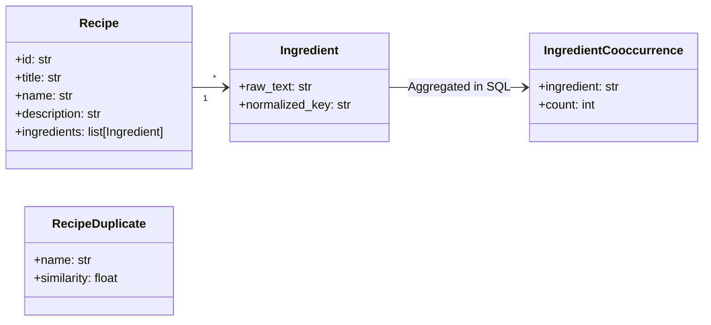
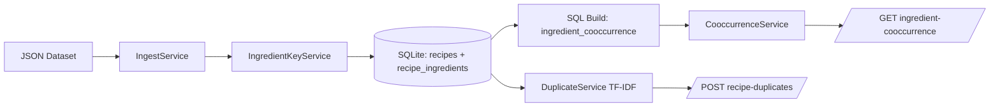

# Recipe Intelligence API - Design & Architecture

> **Design Flow**
> 0. Understanding -> 1. Requirements -> 2. Core Entity -> 3. API/Interface -> 4. Data Flow -> 5. High-level Design -> 6. Deep Dive / Low-level Design
>
> - High-level Design addresses functional requirements.
> - Low-level Design addresses non-functional requirements and trade-offs.

---

## 0. Understanding

### Problem Statement

Build a Python PoC that improves recipe intelligence for Allrecipes data:

1. **Task 1 (required):** Find top co-occurring ingredients for an input ingredient.
2. **Task 2 (optional):** Find top similar recipes for a newly uploaded recipe.

### Input Data

| Dataset | Format | Size | Description |
|---|---|---|---|
| `allrecipes.com_database_12042020000000.json` | JSON array | ~68k recipes | Recipe metadata + ingredient strings |

### Data Characteristics

- Ingredients are free text (`"1 teaspoon cinnamon"`, `"3 cups all-purpose flour"`).
- Quantity, units, and preparation words create noisy tokens.
- Same ingredient appears in different textual forms (`egg` vs `eggs`).
- Co-occurrence counts should be recipe-level, not duplicate row-level.

---

## 1. Requirements

### Functional Requirements (FR)

| ID | Requirement |
|---|---|
| FR-1 | Ingest recipe data and make it queryable. |
| FR-2 | Build top 10 co-occurring ingredients for an input ingredient. |
| FR-3 | Expose HTTP API endpoint for Task 1 response shape from assignment. |
| FR-4 | (Optional) Return top 5 likely duplicate recipes with similarity score. |

### Non-Functional Requirements (NFR)

| ID | Requirement | Design Decision |
|---|---|---|
| NFR-1 | Keep PoC simple and maintainable | SQLite + small service/repository layers |
| NFR-2 | Deterministic and testable behavior | Explicit DI by constructor (`__init__`) |
| NFR-3 | Good ingest performance on full dataset | Bulk insert + SQL aggregation |
| NFR-4 | Handle dirty ingredient strings | Deterministic normalization pipeline |

---

## 2. Core Entities



### Normalized Ingredient Key

Task 1 uses a deterministic normalizer (`IngredientKeyService`) instead of hard-coded canonical catalogs:

- lowercase + unicode normalize
- remove quantities/units/preparation words
- basic singularization rules
- optional alias map for known exceptions

This keeps ingestion robust for unseen ingredient strings.

---

## 3. API / Interface

### CLI

```bash
python -m src.cli ingest
```

### REST API

```bash
uvicorn src.main:create_app --factory --port 8000
```

| Method | Endpoint | Description |
|---|---|---|
| `GET` | `/health` | Health check |
| `GET` | `/api/ingredient-cooccurrence?ingredient=cinnamon&limit=10` | Task 1 top co-occurrence list |
| `POST` | `/api/recipe-duplicates` | Task 2 optional top similar recipes |

---

## 4. Data Flow



Flow details:

1. Parse raw recipes from JSON.
2. Normalize each raw ingredient into `normalized_key`.
3. Store recipes and ingredient rows.
4. Build co-occurrence table with distinct `(recipe_id, normalized_key)` pairs.
5. Serve Task 1 from pre-aggregated table.
6. For Task 2, compute similarity from title + raw ingredient text.

---

## 5. High-level Design

### Project Structure

```text
recipe-api/
|- src/
|  |- core/                     # settings, exception handling
|  |- domains/                  # Recipe, Ingredient, Cooccurrence, Duplicate
|  |- repositories/
|  |  |- sqlite_repository.py   # DB operations
|  |  `- queries.py             # SQL DDL + DML
|  |- services/
|  |  |- ingest_service.py
|  |  |- ingredient_key_service.py
|  |  |- cooccurrence_service.py
|  |  `- duplicate_service.py
|  |- handlers/
|  |  |- cli/ingest.py
|  |  `- http/*.py
|  |- cli.py
|  `- main.py                   # create_app factory
|- data/
|- tests/
`- docs/
```

### Layer Responsibility

| Layer | Responsibility |
|---|---|
| Handlers | HTTP/CLI input-output contracts |
| Services | Business logic and orchestration |
| Repository | SQL execution and persistence |
| Domains/Schemas | Typed request/response and internal models |

---

## 6. Deep Dive / Low-level Design

### 6.1 Task 1 SQL Strategy

Build co-occurrence with deduplicated recipe-ingredient pairs:

```sql
WITH distinct_recipe_ingredients AS (
  SELECT DISTINCT recipe_id, normalized_key
  FROM recipe_ingredients
  WHERE normalized_key IS NOT NULL
)
SELECT a.normalized_key, b.normalized_key, COUNT(*)
FROM distinct_recipe_ingredients a
JOIN distinct_recipe_ingredients b
  ON a.recipe_id = b.recipe_id
 AND a.normalized_key != b.normalized_key
GROUP BY a.normalized_key, b.normalized_key;
```

This avoids inflated counts when an ingredient repeats inside one recipe text list.

### 6.2 Task 2 (Optional) Strategy

Current PoC uses simple TF-IDF cosine similarity over:

- recipe title
- raw ingredient names

Why this level is appropriate for optional scope:

- easy to explain
- dependency-light
- sufficient for PoC ranking output

### 6.3 Error Handling

| Scenario | Behavior |
|---|---|
| Missing/empty normalized ingredient in query | 404 with `IngredientNotFoundError` |
| No co-occurrence rows found | 404 with clear message |
| Empty recipe corpus for duplicates | returns empty list |

### 6.4 Testing Strategy

- **Task 1 tests:** ingest aggregation, query normalization, 404 case.
- **Task 2 tests:** ranked duplicates for similar input, empty list for unrelated input.
- Test fixtures build temporary SQLite DB and ingest deterministic sample data.

---

## 7. Deployment Notes

- Docker image supports both `dev` and `prod` targets.
- `docker-compose.yml` provides:
  - `api` service for FastAPI
  - `ingest` one-shot service
  - `test` service for pytest
- Runtime config is environment-driven (`DATA_DIR`, `SQLITE_DB_PATH`, `LOG_LEVEL`).

---

## 8. Future Improvement: Inverted Index

An **inverted index** maps each term to the set of documents (recipes) containing it:

```text
"cinnamon"  → {recipe_1, recipe_2, recipe_3, recipe_4, recipe_5}
"sugar"     → {recipe_1, recipe_2, recipe_4, recipe_5}
"salt"      → {recipe_3, recipe_6}
```

### 8.1 Task 1 — Already Implicit

The `recipe_ingredients` table with `(recipe_id, normalized_key)` already functions as an inverted index.
The self-join in `BUILD_COOCCURRENCES` exploits this: for every recipe containing ingredient A, find all other ingredients B in the same recipe.

The pre-computed `ingredient_cooccurrence` table makes query time O(1), so no further optimization is needed at the query layer.

### 8.2 Task 2 — Major Opportunity

The current `DuplicateService` loads **all** recipes and computes TF-IDF similarity against each one — O(n) per request.

With an inverted index the query only visits recipes that share at least one token with the input:

```text
token → [(recipe_id, tfidf_weight), ...]
```

At query time:

1. Tokenize the input recipe.
2. For each query token, look up the posting list from the inverted index.
3. Accumulate dot-product scores only for recipes that appear in those lists.
4. Return the top-k scored candidates.

This reduces complexity from O(n) to O(k) where k ≪ n (only recipes sharing tokens with the query).

```
# Build once at ingest time:
# token → list of (recipe_id, tf_score)
inverted_index = {
    "cinnamon": [(recipe_4, 0.3), (recipe_5, 0.25), (recipe_1, 0.2), ...],
    "flour":    [(recipe_4, 0.4), (recipe_5, 0.35), ...],
    "bread":    [(recipe_4, 0.5), (recipe_5, 0.45), ...],
}

# At query time for "Cinnamon Bun Bread" with ingredients [flour, sugar, cinnamon]:
query_tokens = ["cinnamon", "bun", "bread", "flour", "sugar"]

candidate_scores = Counter()
for token in query_tokens:
    for recipe_id, tf_score in inverted_index[token]:  # only recipes with this token
        candidate_scores[recipe_id] += query_tfidf[token] * tf_score

# Only score recipes that share at least one token — typically << 68k

```

### 8.3 Comparison

| Aspect | Current PoC | With Inverted Index |
|---|---|---|
| Task 1 query | O(1) pre-computed | Same — already optimal |
| Task 2 query | O(n) brute-force scan | O(k) — only matching recipes |
| Task 2 build | None (on-the-fly) | One-time index build at ingest |
| Complexity | Minimal | Moderate — index storage + update logic |

For production scale, the next step beyond an inverted index would be vector embeddings with approximate nearest neighbor search (FAISS or pgvector).
